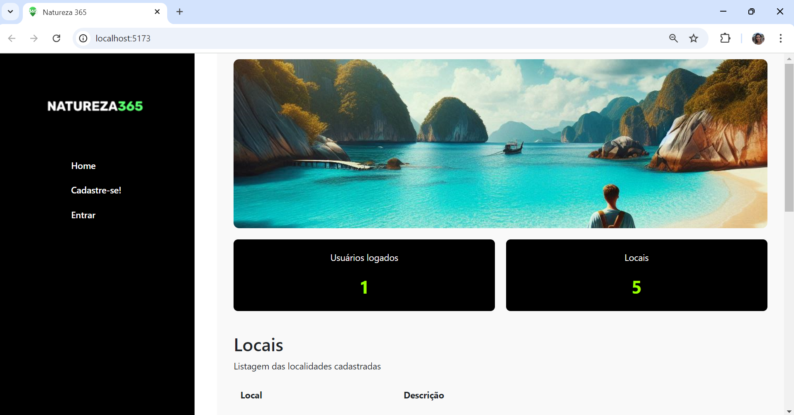

# Projeto final - Módulo 03 - FloripaMaisTec - FuturoDEV/Nature - Squad 3

## 📌 Descrição do Projeto 
API Rest para integração de dados no projeto final do módulo 3 do curso Analista de Desenvolvimento Web do Sesi/Senai.

# API Rest Natureza 365 - Plataforma de Preservação da Natureza 🌳

## 🌿 Apresentação
Bem-vindo ao Natureza 365, uma plataforma digital dedicada à preservação da natureza que oferece dados sobre espaços naturais aos usuários.
Também possibilita aos usuários explorarem, cadastrarem e compartilharem informações sobre áreas naturais, trilhas, parques ecológicos, reservas ambientais, praias e outros locais de interesse para amantes da natureza.

## 💡 Problema que Resolve 
O Natureza 365 resolve o problema de gerenciamento e organização de informações sobre locais da natureza, permitindo que os usuários cadastrem, visualizem, editem e excluam dados de forma eficiente e centralizada.

## 💻 Funcionalidades
- Adicionar usuários e locais
- Login e autenticação
- Visualizar listas de locais
- Excluir e editar itens cadastrados

## 🙋 Tela Dashboard

## 💻 Tecnologias utilizadas
- **Back-End**: JavaScript, Node.js, Express, Sequelize, Seeders
- **Ferramentas**: Visual Studio Code, GitHub, Trello, Postman e PgAdmin4.

## ☁️ Banco de dados
 Para esta aplicação, usamos o banco de dados PostgreSql, sendo necessária a instalação do [PostgreSql](https://www.postgresql.org/) e do [pgAdmin4](https://www.pgadmin.org/download/) na máquina.

## ⚙️ Rodar o repositório:
### 📋 Pré-requisitos
Antes de começar, você vai precisar ter instalado em sua máquina as seguintes ferramentas:
[Git](https://git-scm.com), [Node.js](https://nodejs.org/en/).
Além disso é bom ter um editor para trabalhar com o código como [VSCode](https://code.visualstudio.com/)

### Clone o repositório
`git clone <https://github.com/FuturoDEV-Nature/M3P-BackEnd-Squad3>`

### Acesse a pasta do projeto no terminal/cmd
 `cd PROJETO NATURE365`

### configure o arquivo .env
No diretório principal, crie um arquivo .env e cole dentro dele o texto que você extrairá do arquivo .env_example. Em seguida altere seu login e senha do postgres no arquivo .env e salve-o.
 `cp .env_example .env`

### Instale as dependências
 `npm install`

### Rode as migrations
 `sequelize db:migrate`
ou
 `npx sequelize db:migrate`

### Rode os seeders na seguinte ordem:
1º. `npx sequelize-cli db:seed --seed Usuarios.seeder.js`
2º. `npx sequelize-cli db:seed --seed Locais.seeder.js`

### Execute a aplicação em modo de desenvolvimento
 `npm run start:dev`
 ou
 `node src/index.js`

### O servidor inciará na porta:3000 - acesse <http://localhost:3000>

## 📖 Documentação da API com Swagger
 Para a documentação desta API utilizamos o [Swagger](https://swagger.io/), que é um conjunto de ferramentas criada pela SmartBear para ajudar desenvolvedores na documentação de API's.

### Para acessar a interface gráfica do Swagger
 Com o servidor rodando - acesse <http://localhost:3000/docs>

 
### 🖇️ Projeto orientado por:
Profº Bruno Costa

### 👊 Contribuições 💡 
O projeto ainda carece de melhorias, como o uso de controllers, criptografia de senha a partir da biblioteca bcrypt, adição de imagens nos locais cadastrados...
Fiquem à vontade para sugerir ideias e nos ajudar a deixar o Natureza 365 mais completo e funcional!
Desde já, agradecemos!

 
### ✒️ Projeto desenvolvido por:
Rodrigo Ribeiro
Josué Santos
Leiliane Costa

## 📞 Contato 
- [@leilianelcs](https://www.github.com/leilianelcs)
- 📫 leilianelc@gmail.com

- [@josuesantos7](https://www.github.com/josuesantos7)
- 📫 josuesantossantosvf@gmail.com

- [@RodRibDev](https://www.github.com/RodRibDev)
- 📫 rodrigo_r_ribeiro@estudante.sesisenai.org.br